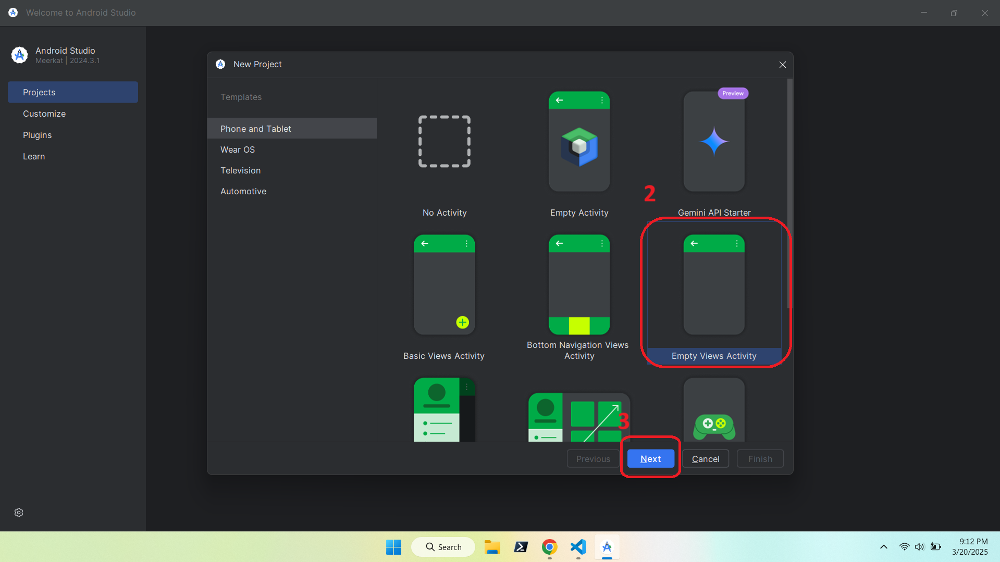
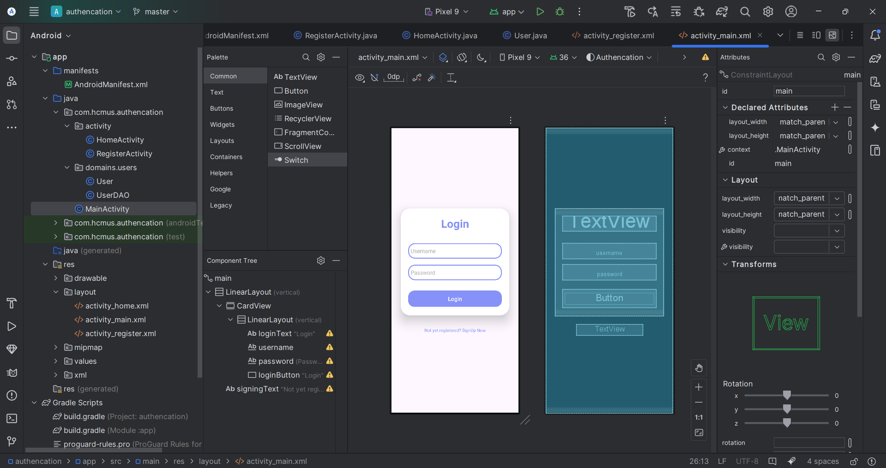
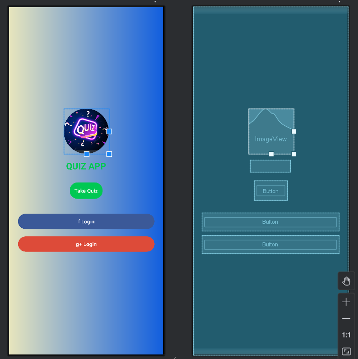
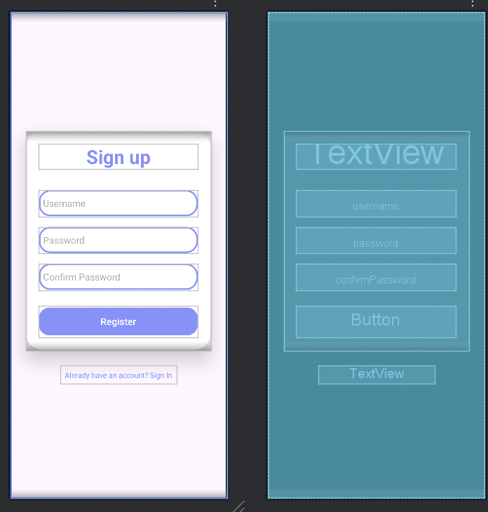
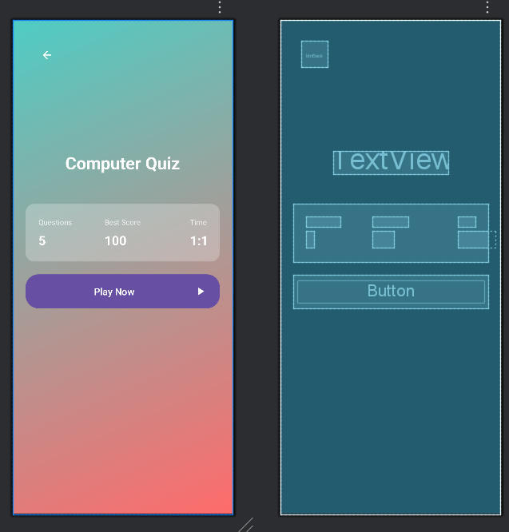

# 📱 Android App: Ứng dụng Android hệ thống đăng nhập

Ứng dụng này là một ví dụ về hệ thống đăng nhập và đăng ký đơn giản cho Android. Người dùng có thể đăng nhập vào ứng dụng bằng tài khoản đã đăng ký hoặc tạo tài khoản mới. Sau khi đăng nhập thành công, người dùng sẽ được chuyển đến màn hình trang chủ.

---
## 🎬 Chương trình ứng dụng và kiểm thử

---

##  🎬 Xem tại Youtube
[](https://youtube.com/shorts/vxsCh-v55zc)


---

## 🚀 1. Tạo Project mới trong Android Studio
Tạo một dự án mới trong **Android Studio**:


---

## 🏗️ 2. Chọn loại Activity
Chọn **Basic View Activity** để có giao diện cơ bản:


---

## ✏️ 3. Đặt tên project và chọn cấu hình Android
Nhập tên ứng dụng, package name, và chọn ngôn ngữ **Java/Kotlin**:


---

## 🖥️ 4. Màn hình chính trong Android Studio
Khi mở dự án, bạn sẽ thấy giao diện chính gồm **XML Layouts** và **MainActivity**:


---

## 🎨 5. Thiết kế giao diện (Layout)

### 🔹 Main Activity
Màn hình chính hiển thị thông tin các field cho đăng nhập

---
### 🔹 Register Activity
Màn hình chính hiển thị thông tin các field cho đăng nhập

---
### 🔹 Home Activity
Màn hình chính hiển thị thông tin các field cho đăng nhập

---
## 🔍 Tính năng

- **Đăng nhập**: Người dùng có thể đăng nhập bằng tài khoản đã có sẵn. Nếu đăng nhập thành công, người dùng sẽ được chuyển đến màn hình **HomeActivity**.
- **Đăng ký**: Người dùng có thể tạo tài khoản mới. Mật khẩu phải được xác nhận để đảm bảo tính chính xác.
- **Đăng xuất**: Sau khi đăng nhập, người dùng có thể đăng xuất và quay lại màn hình đăng nhập.
## ⚙️ 6. Cách hoạt động
1. **MainActivity**: Đây là màn hình đăng nhập, nơi người dùng nhập tên đăng nhập và mật khẩu. Nếu thông tin chính xác, người dùng sẽ được chuyển đến màn hình **HomeActivity**.
2. **RegisterActivity**: Màn hình đăng ký tài khoản, nơi người dùng có thể tạo tài khoản mới nếu chưa có.
3. **HomeActivity**: Màn hình chính sau khi người dùng đăng nhập thành công.
---
## 🛠️ 7. Cách chạy ứng dụng

1. Clone repo này về máy:
   ```sh
   git clone https://github.com/Trung78z/AndroidPractice3Authencation.git
   ```
2. Mở **Android Studio** và import project.
3. Chạy ứng dụng trên **Emulator** hoặc **thiết bị thật**.


---

## 📩 8. Liên hệ
Nếu có thắc mắc hoặc góp ý, vui lòng liên hệ qua email: `trungpspy@gmail.com`.