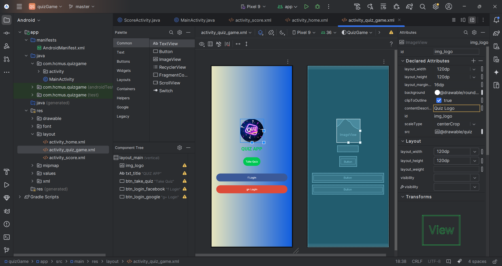

# 🎯 Ứng dụng Quiz Android

Ứng dụng này là một ví dụ về hệ thống đăng nhập và đăng ký đơn giản cho Android. Người dùng có thể đăng nhập vào ứng dụng bằng tài khoản đã đăng ký hoặc tạo tài khoản mới. Sau khi đăng nhập thành công, người dùng sẽ được chuyển đến màn hình trang chủ.

---
## 🎬 Chương trình ứng dụng và kiểm thử

---

##  🎬 Xem tại Youtube
[](https://youtube.com/shorts/ilhM-8aTlvk)


---

## 🚀 1. Tạo Project mới trong Android Studio
Tạo một dự án mới trong **Android Studio**:


---

## 🏗️ 2. Chọn loại Activity
Chọn **Basic View Activity** để có giao diện cơ bản:


---

## ✏️ 3. Đặt tên project và chọn cấu hình Android
Nhập tên ứng dụng, package name, và chọn ngôn ngữ **Java/Kotlin**:


---

## 🖥️ 4. Màn hình chính trong Android Studio
Khi mở dự án, bạn sẽ thấy giao diện chính gồm **XML Layouts** và **MainActivity**:


---
## 🎨 Giao diện ứng dụng

### Màn hình chính

- Lựa chọn chủ đề quiz

### Màn hình làm bài

- Hiển thị câu hỏi và đáp án

### Màn hình kết quả

- Thống kê đáp án đúng/sai
- Điểm số và xếp hạng
## 🛠️ 7. Cách chạy ứng dụng

1. Clone repo này về máy:
   ```sh
   git clone https://github.com/Trung78z/AndroidPractice4AppQuiz.git
   ```
2. Mở **Android Studio** và import project.
3. Chạy ứng dụng trên **Emulator** hoặc **thiết bị thật**.


---

## 📩 8. Liên hệ
Nếu có thắc mắc hoặc góp ý, vui lòng liên hệ qua email: `trungpspy@gmail.com`.